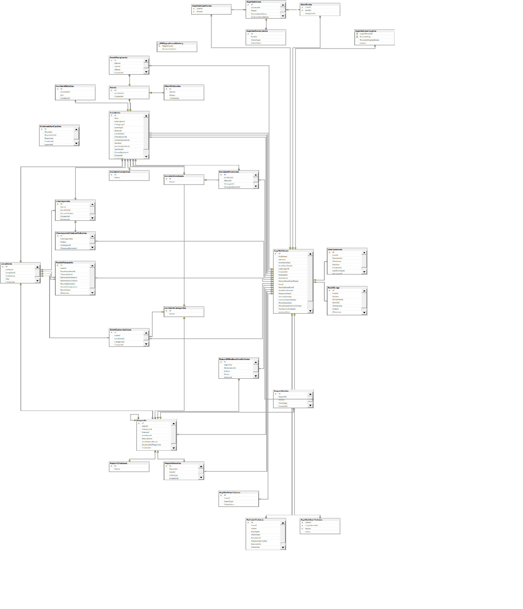

<div align="center">

#  Wasel Palestine
### Smart Mobility & Checkpoint Intelligence Platform


*An API-centric backend platform providing structured, real-time mobility intelligence to help Palestinians navigate daily movement challenges — including checkpoints, road incidents, and route estimation.*

</div>

---

##  Table of Contents

- [System Overview](#-system-overview)
- [Architecture](#-architecture)
- [Tech Stack & Justification](#-tech-stack--justification)
- [Database Schema](#-database-schema)
- [API Design](#-api-design)
- [External API Integrations](#-external-api-integrations)
- [Getting Started](#-getting-started)
- [Testing Strategy](#-testing-strategy)
- [Performance Results](#-performance-results)
- [Project Structure](#-project-structure)

---

##  System Overview

**Wasel Palestine** is a backend-only RESTful API platform built to aggregate and expose mobility data across the West Bank. It supports:

-  **Checkpoint & Incident Management** — Real-time status tracking with full history
-  **Crowdsourced Reporting** — Citizens submit reports with voting-based credibility
-  **Route Estimation** — Intelligent routing that factors in checkpoints and live incidents
-  **Alert & Notification System** — Subscription-based alerts triggered by verified incidents
-  **Weather Integration** — Contextual conditions layered onto mobility data

> The system is exclusively a **backend API**. UI development is out of scope. All functionality is exposed through versioned endpoints at `/api/v1/...`.

---

##  Architecture

```
┌──────────────────────────────────────────────────────┐
│             CLIENT (Mobile App / Dashboard)           │
└─────────────────────┬────────────────────────────────┘
                      │  HTTPS + JWT Bearer
┌─────────────────────▼────────────────────────────────┐
│           Presentation Layer  (Wasel_Palestine.PL)    │
│  Controllers · Rate Limiting · Swagger · Middleware   │
│  Auth · Checkpoints · Incidents · Reports             │
│  Routes · Alerts · Admin                              │
└─────────────────────┬────────────────────────────────┘
                      │  Service Interfaces (DI)
┌─────────────────────▼────────────────────────────────┐
│         Business Logic Layer  (Wasel_Palestine.BAL)   │
│  IncidentService · CheckpointService                  │
│  MobilityService · WeatherService · AlertService      │
│  ReportingService · AuthenticationService             │
└─────────────────────┬────────────────────────────────┘
                      │  Repository Pattern
┌─────────────────────▼────────────────────────────────┐
│           Data Access Layer  (Wasel_Palestine.DAL)    │
│  EF Core DbContext · Repositories · Models · DTOs     │
│  Migrations · Seed Data · ASP.NET Identity            │
└──────────┬──────────────────────────┬────────────────┘
           │                          │
┌──────────▼──────────┐   ┌───────────▼──────────────┐
│   SQL Server 2022   │   │      External APIs         │
│  (Docker Container) │   │  Open-Meteo · OSRM        │
└─────────────────────┘   └──────────────────────────┘
```

### Deployment

The application is fully containerised. Two Docker services are defined in `docker-compose.yml`:

| Service | Image | Port |
|---|---|---|
| `sqlserver` | `mcr.microsoft.com/mssql/server:2022-latest` | 1433 |
| `api` | `waselpalestinepl:latest` | 8080 → 80 |

Both services communicate over a shared Docker network (`waselnet`). EF Core migrations run automatically on startup.

---

##  Tech Stack & Justification

| Concern | Choice | Reason |
|---|---|---|
| **Framework** | ASP.NET Core (.NET 10) |High-throughput async pipeline, first-class DI, built-in middleware for rate limiting, auth, compression |
| **Architecture** | Clean Architecture (3 layers) | Strict separation of concerns; DAL/BAL/PL are independent projects |
| **ORM** | Entity Framework Core + Raw SQL | EF for productivity; raw SQL for performance-critical queries |
| **Database Engine** | SQL Server 2022 | Relational integrity, NetTopologySuite for spatial types, ACID compliance |
| **DB Management** | SQL Server Management Studio (SSMS) | Schema design, query testing, migration verification, and database administration |
| **Authentication** | ASP.NET Identity + JWT (access + refresh) | Hardened user management, token rotation, account lockout |
| **Mapping** | Mapster | Zero-reflection mapping, faster than AutoMapper |
| **Containerisation** | Docker + docker-compose | Reproducible environments for the API layer |
| **Documentation** | Swagger (Swashbuckle) + API-Dog | Auto-generated docs from code, shareable test collections |

---

##  Database Schema
### Entity Relationship Overview

The diagram below shows the full relational schema generated from SQL Server Management Studio (SSMS).

<div align="center">
  
</div>

Full resolution image: images1/dig.png

##  API Design

### Versioning & Route Structure

All endpoints are versioned at `/api/v1/`. Admin routes use `/api/admin/` with stricter authorization policies.

### Endpoint Reference

| Prefix | Controller | Description |
|---|---|---|
| `POST /api/v1/Auth/register` | AuthController | Register new user |
| `POST /api/v1/Auth/login` | AuthController | Login, receive access + refresh tokens |
| `POST /api/v1/Auth/refresh` | AuthController | Rotate refresh token |
| `POST /api/v1/Auth/logout` | AuthController | Revoke session |
| `GET /api/v1/Me` | MeController | Current user profile |
| `GET/POST/PUT/DELETE /api/v1/Checkpoints` | CheckpointsController | CRUD, status change, history, heatmap |
| `GET/POST/PUT/DELETE /api/v1/Incidents` | IncidentsController | CRUD, verify, close, filter, paginate |
| `POST /api/v1/Incidents/{id}/verify` | IncidentsController | Moderator verifies an incident |
| `GET/POST /api/v1/Reports` | ReportsController | Submit, list, vote, moderate |
| `GET /api/v1/Routes/estimate` | RoutesController | Route estimation with checkpoint awareness |
| `GET/POST /api/v1/Alerts` | AlertsController | Subscribe, list alerts |
| `GET /api/admin/users` | AdminUsersController | Manage user accounts and roles |
| `GET /api/admin/auditlogs` | AdminAuditLogsController | Read-only audit log |

### Design Decisions

- **Consistent response envelope** — All responses use `BaseResponse<T>` with `success`, `message`, and `data` fields
- **Pagination** — Every list endpoint accepts `page` and `pageSize` query parameters; no unbounded queries
- **Soft deletes** — Entities set `DeletedAt` rather than being physically removed
- **Filtering** — Query params for `status`, `categoryId`, `city`, `severity`, etc. on all list endpoints
- **Bilingual support** — Incidents and checkpoints store both English and Arabic fields
- **Rate limiting** — Two tiers: `fixed-by-ip` (10,000 req/min general), `strict-by-ip` (500 req/min for sensitive routes)
- **Response compression** — Enabled via `UseResponseCompression()` middleware

### Authentication & Authorization

```
Roles:  Admin  |  Moderator  |  Citizen
```

- JWT Bearer with access + refresh token pair
- `ClockSkew = TimeSpan.Zero` — strict token expiry
- Global `ActiveUserOnly` policy — all requests require `isActive = true` claim
- Account lockout: 5 failed attempts → 10-minute lock
- Policies: `AdminOnly`, `ModeratorOnly`, `AdminOrModerator`

---

##  External API Integrations

### 1. Open-Meteo (Weather)

| Property | Detail |
|---|---|
| **Provider** | [open-meteo.com](https://open-meteo.com) — free, no API key |
| **Endpoint** | `https://api.open-meteo.com/v1/forecast?latitude={lat}&longitude={lon}&current_weather=true` |
| **Data** | Temperature (°C), weather condition mapped from WMO code |
| **Caching** | `IMemoryCache` with 30-minute TTL, keyed by rounded lat/lon |
| **Background sync** | `WeatherBackgroundService` (IHostedService) refreshes key areas periodically |
| **Error handling** | `try/catch` around HttpClient; throws descriptive exception if unavailable |

Weather condition codes are mapped to human-readable strings (Clear Sky, Fog, Rain, Thunderstorm, etc.) via a switch expression in `WeatherService`.

### 2. OSRM — Open Source Routing Machine

| Property | Detail |
|---|---|
| **Provider** | [router.project-osrm.org](http://router.project-osrm.org) — free public demo |
| **Endpoint** | `http://router.project-osrm.org/route/v1/driving/{lng},{lat};{lng2},{lat2}?overview=false` |
| **Data** | Distance (m → km), Duration (s → min) |
| **Caching** | Results stored in `ExternalApiCache` table for repeated route pairs |
| **Error handling** | Non-success status raises `"Routing service (OSRM) unavailable"` exception |

**Mobility intelligence layer** — `MobilityService` enriches the raw OSRM response:

```
Final Duration = OSRM base duration
              + Σ checkpoint delay penalties (Closed: +60m, Partially Closed: +30m, Busy: +est.)
              + Σ active incident delay (High severity: +25m, Medium: +15m, Low: +5m)

If avoidCheckpoints = true:
  Distance × 1.4  (alternate route estimate)
  +120 min per avoided checkpoint
```

---

##  Getting Started

### Prerequisites

- [.NET 10 SDK](https://dotnet.microsoft.com/download/dotnet/10.0)
- [SQL Server 2022](https://www.microsoft.com/en-us/sql-server/sql-server-downloads) (local installation)
- [SQL Server Management Studio (SSMS)](https://aka.ms/ssmsfullsetup) — for database administration
- [Docker](https://www.docker.com/) & Docker Compose — for running the API container

### Database Setup (SQL Server + SSMS)

The project uses a locally installed SQL Server instance managed via SSMS. EF Core migrations handle schema creation automatically on startup.

```bash
# 1. Open SSMS and connect to your local SQL Server instance
#    (e.g. localhost or .\SQLEXPRESS)

# 2. Create the database (or let EF Core create it automatically on first run)
#    In SSMS: New Query → CREATE DATABASE WaselPalestineDB;

# 3. Update the connection string in appsettings.Development.json
```

```json
{
  "ConnectionStrings": {
    "DefaultConnection": "Server=localhost;Database=WaselPalestineDB;User Id=sa;Password=YourPassword;TrustServerCertificate=True;"
  }
}
```

> **Tip:** If using Windows Authentication instead of SQL login:
> ```
> Server=localhost;Database=WaselPalestineDB;Trusted_Connection=True;TrustServerCertificate=True;
> ```

### Run the API

```bash
# 1. Clone the repository
git clone https://github.com/your-org/WaselPalestine.git
cd WaselPalestine

# 2. Apply EF Core migrations (creates all tables automatically)
cd Wasel_Palestine.PL
dotnet ef database update

# 3. Run the API
dotnet run

# API is available at:
#   https://localhost:5001
#   Swagger UI: https://localhost:5001/swagger
```

### Run with Docker (API only)

If you prefer to run only the API in Docker while keeping SQL Server local:

```bash
# Build the API image
docker build -f Wasel_Palestine.PL/Dockerfile -t waselpalestinepl:latest .

# Run with your local SQL Server connection string
docker run -p 8080:80 \
  -e "ConnectionStrings__DefaultConnection=Server=host.docker.internal;Database=WaselPalestineDB;User Id=sa;Password=YourPassword;TrustServerCertificate=True;" \
  waselpalestinepl:latest

# API available at: http://localhost:8080
# Swagger UI:       http://localhost:8080/swagger
```

> Database migrations run automatically on startup. Seed data (roles, default admin user, report statuses) is applied via the seeder services.

### Default Seed Accounts

| Role | Created by |
|---|---|
| Admin | `UserSeedData` seeder |
| Moderator | `UserSeedData` seeder |

> See `Wasel_Palestine.DAL/Utils/UserSeedData.cs` for credentials.

### Environment Variables

Override `appsettings.json` values via environment variables or `appsettings.Development.json`:

```env
ConnectionStrings__DefaultConnection=Server=localhost;Database=WaselPalestineDB;User Id=sa;Password=...;TrustServerCertificate=True;
Jwt__SecretKey=your-secret-key
Jwt__Issuer=WaselPalestine
Jwt__Audience=WaselPalestineUsers
```

---

##  Testing Strategy

### API Documentation

Swagger UI is available at `/swagger` with full JWT Bearer authentication support. An API-Dog collection is also exported with:
- All endpoint descriptions and schemas
- Environment configurations (local / Docker)
- Saved test execution results

### Load Testing (k6)

Five k6 scripts cover all required scenarios. Run with:

```bash
k6 run --env TOKEN=<your_jwt> LoadTests/read-heavy.js
k6 run --env TOKEN=<your_jwt> LoadTests/write-heavy.js
k6 run --env TOKEN=<your_jwt> LoadTests/mixed.js
k6 run --env TOKEN=<your_jwt> LoadTests/spike.js
k6 run --env TOKEN=<your_jwt> LoadTests/soak.js
```

| Script | Scenario | VUs | Thresholds |
|---|---|---|---|
| `read-heavy.js` | GET Incidents, Checkpoints, AuditLogs + 1 POST Report | 0 → 25 | p95 < 800ms, error < 5% |
| `write-heavy.js` | POST /Reports/submit (random coordinates) | 0 → 15 | p95 < 1000ms, error < 5% |
| `mixed.js` | 70% GET Incidents / 30% POST Report | 0 → 100 (spike) | Observe degradation |
| `soak.js` | Sustained mixed load | 15 (steady) | Monitor drift & leaks |
| `spike.js` | Sudden burst to 100 VUs | 0 → 100 → 0 | Observe recovery |

---

##  Performance Results

All tests were run against the Dockerised application. Results are stored in `LoadTests/results/`.

### Metrics Summary

| Scenario | Total Requests | Avg (ms) | p95 (ms) | Max (ms) | Error Rate |
|---|---|---|---|---|---|
| Write-Heavy | 1,073 | 40.4 | 155.7 | 539.7 | 0.0%  |
| Mixed / Final | 8,880 | 61.2 | 169.2 | 927.3 | 0.0%  |
| Soak (Sustained) | 4,370 | 37.6 | 72.2 | 388.8 | 0.0%  |
| Spike (100 VUs) | 3,666 | 1,064.3 | 3,053.8 | 6,853.2 | 0.0%  |

### Analysis

** Strengths**
- Zero errors across all 18,000+ requests
- Soak test shows no latency drift or memory leak over 6 minutes
- Write-heavy workload at 15 VUs is well within thresholds (p95 = 155ms)

** Spike Test — High Latency**
- At 100 concurrent VUs, p95 reached ~3 seconds
- Root cause: SQL Server connection pool saturation; duplicate-detection queries perform table scans under concurrent write pressure

### Optimisations Applied

| Optimisation | Impact |
|---|---|
| `IMemoryCache` for weather API (30-min TTL) | Eliminates redundant external HTTP calls |
| Response compression middleware | Reduces payload size on large list responses |
| Pagination enforced on all list endpoints | Prevents unbounded query execution |
| Rate limiting (two-tier IP-based) | Protects against burst abuse |
| Full async/await throughout service layer | No synchronous thread blocking |

### Recommended Future Improvements

- Add database indexes on `Incident.StatusId`, `Incident.CategoryId`, `Report.LocationId`, `Checkpoint.CurrentStatus`
- Replace in-process `IMemoryCache` with **Redis** for horizontal scaling
- Implement compiled EF Core queries for high-frequency read paths
- Consider **read replicas** for the SQL Server instance under heavy read load

---

##  Project Structure

```
WaselPalestine/
├── Wasel_Palestine.PL/               # Presentation Layer
│   ├── Area/
│   │   ├── Auth/                     # AuthController, MeController
│   │   ├── Checkpoints/              # CheckpointsController, StatusesController
│   │   ├── Incidents/                # IncidentsController + category/severity/status/media
│   │   ├── Reports/                  # ReportsController
│   │   ├── Routes/                   # RoutesController
│   │   ├── Alerts/                   # AlertsController
│   │   └── Admin/                    # AdminUsersController, AdminAuditLogsController
│   ├── Program.cs                    # DI setup, middleware pipeline
│   ├── Dockerfile
│   └── appsettings.json
│
├── Wasel_Palestine.BAL/              # Business Logic Layer
│   ├── Service/                      # All service implementations
│   │   ├── IncidentService.cs
│   │   ├── CheckpointService.cs
│   │   ├── MobilityService.cs        # Route estimation + OSRM integration
│   │   ├── WeatherService.cs         # Open-Meteo integration
│   │   ├── WeatherBackgroundService.cs
│   │   ├── ReportingService.cs
│   │   ├── AlertService.cs
│   │   └── AuthenticationService.cs
│   └── Helper/
│       ├── PalestineGridHelper.cs
│       └── WeatherRuleHelper.cs
│
├── Wasel_Palestine.DAL/              # Data Access Layer
│   ├── Model/                        # Entity classes
│   ├── DTO/
│   │   ├── Request/                  # Input DTOs
│   │   └── Response/                 # Output DTOs
│   ├── Repository/                   # Repository interfaces + implementations
│   ├── Data/
│   │   └── ApplicationDbContext.cs   # EF Core DbContext + model config
│   ├── Migrations/                   # EF Core migration history
│   └── Utils/                        # Seeders, AuditLogger
│
├── LoadTests/                        # k6 load test scripts
│   ├── read-heavy.js
│   ├── write-heavy.js
│   ├── mixed.js
│   ├── spike.js
│   ├── soak.js
│   └── results/                      # Raw k6 JSON output
│
└── docker-compose.yml
```

---

<div align="center">

**Advanced Software Engineering — Spring 2026**
*Dr. Amjad AbuHassan*

</div>
